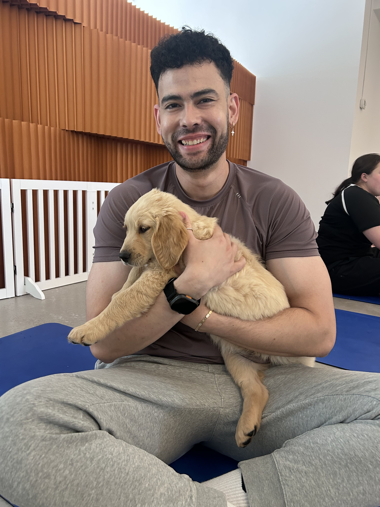

{width=250px}

I am a Master of Data Science student at the University of British Columbia, and
before that I spent six years as an accountant in Vancouver. I grew up in
Barranquilla, Colombia, studied public accounting at Universidad del Norte, and
moved to Canada to keep building on that work. Years of closing books and
chasing down numbers that did not add up taught me that the interesting part was
never the reconciliation itself, but the question underneath it. I am here to
learn how to answer those questions properly, with data.
