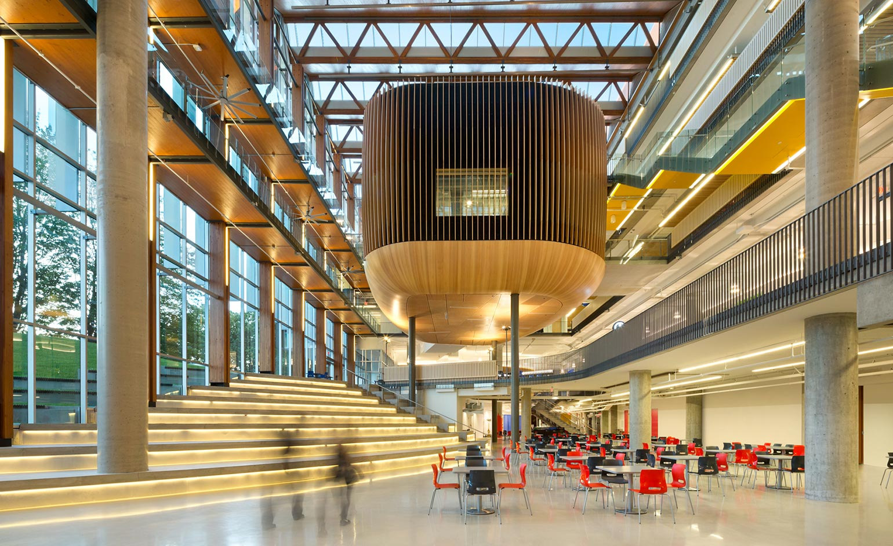

Classes started on August 31st, and the first thing I noticed was the pace. Four
courses running at once, lectures in the morning and labs every afternoon at two,
and a new topic arriving before the previous one has finished settling. Coming
from six years of accounting, where the calendar is built around a monthly close
I could see coming from a week away, this is a different rhythm entirely.

The surprise has not been the statistics or the programming. It has been how much
of the work is infrastructure: SSH keys, version control, rendering pipelines,
getting four different tools to agree on where a file lives. I spent part of a
weekend on an SSH connection that timed out over and over, and the fix turned out
to have nothing to do with my key. That was frustrating at the time and useful in
retrospect, because nobody hands you a working environment in real work either.

Right now I feel busy and slightly behind, which I gather is the normal state
here. What I am looking forward to is the point where the tools stop being the
obstacle and become the thing I reach for without thinking about it.
